### Stream使用

#### 1.Stream
**Stream和集合的区别**：

stream：stream是只计算当前需要的数据，在迭代过程中，stream是放在内部迭代的，集合的迭代是放在外部。在外部迭代就会需要自己解决管理并行的问题。   

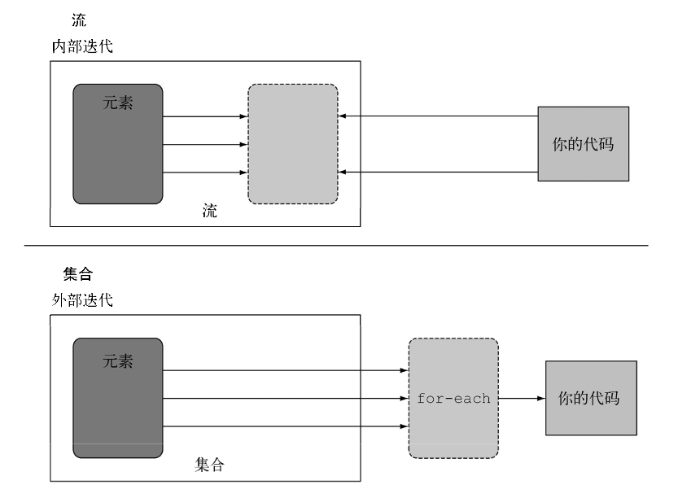

集合：集合是一次计算所有的值，Stream的流只消费一次

#### 2. 流操作
连接起来的流操作称为中间操作，关闭流的操作称为终端操作。
```
List<String> collect = list.stream()
        .filter(e -> e.getId() > 2)  // 中间操作
        .sorted(comparing(YxUser::getCreateTime)) // 中间操作
        .map(YxUser::getUsername) // 中间操作
        .collect(Collectors.toList()); // 终端操作
```


**中间操作和终端操作的区别**：

**中间操作**：如filter、sort、map等中间操作都会返回一个另外一个流。这让多个操作可以连接起来形成一个查询。最重要的是：除非流水线上有一个终端操作，不然中间操作不会做任何处理，因为中间操作都可以合并起来，一起在终端操作一次性全部处理。
**终端操作**：都会从流的流水线产生结果，他的结果不是流。

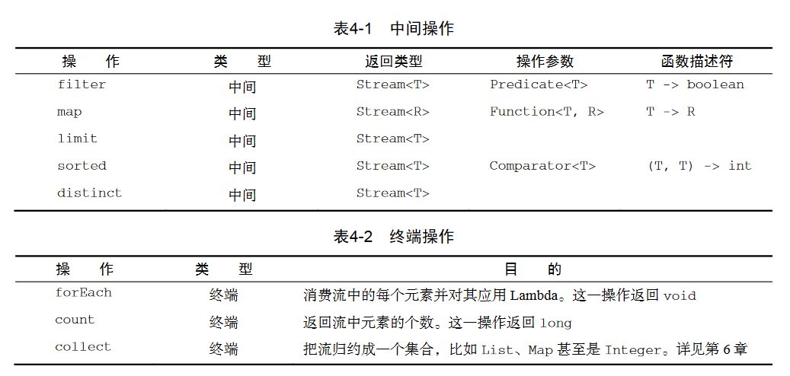

使用流一般包括三件事：①：一个数据源执行一个查询，②一个中间操作链，行程一条流的流水线，③：一个终端操作，执行流水线，生成最终结果。


#### 3.使用流
List<Integer> integerList =Arrays.asList(1,2,2,2,2,2,4,5,6,7,8);

**筛选**：谓词筛选filter 
```java
 List<String> collect = list.stream()
        .filter(e -> e.getId() > 2)  //谓词筛选
        .collect(Collectors.toList()); // 终端操作    
```

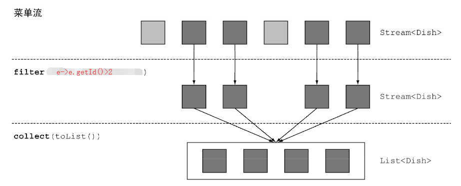

**distinct顾名思义**：去掉重复的。

```java
integerList.stream()
           .filter(i->i%2==0)
           .distinct()
           .forEach(System.out::println);
           //将输出所有偶数并且没有重复的
```

**limit**：返回前N个数据，类似mysql的limit上。
```java
integerList.stream()
        .sorted()
        .limit(2)
        .forEach(System.out::println);
        排序后将输出前两个
```

**skip**：过滤掉前n个元素。

```java
integerList.stream()
        .sorted()
        .skip(2)
        .limit(2)
        .forEach(System.out::println); 
        //排序后，先过滤前两个，在输出前两个。实际输出的是第3,4两个。
```

**映射**：

map:一般的用法：map就是取其中的一列
```java
List<YxUser> list = Arrays.asList(
        new YxUser(1,"yanxgin","222","823721670@qq.com"),
        new YxUser(2,"12","222","823721670@qq.com"),
        new YxUser(3,"yan34xgin","222","823721670@qq.com"),
        new YxUser(4,"56","222","823721670@qq.com"),
        new YxUser(5,"78","222","823721670@qq.com"),
        new YxUser(6,"90","222","823721670@qq.com"),
        new YxUser(7,"666","222","823721670@qq.com")
 );

List<String> collect = list.stream()
        .filter(e -> e.getId() > 2)  // 中间操作
        .map(YxUser::getUsername) // 中间操作
        .collect(Collectors.toList()); // 终端操作
        将会返回username这一列
```

> map(Arrays::Stream)和flatMap(Arrays::Stream)的区别：前者是将数据转换成一个单独的流。
> 后者是将把流中的每个值都换成另外一个流，典型的列子是怎么统计一句英文句子中不同的字符。

**匹配**

anyMatch表示数据集中是不是有一个元素能够匹配给定的谓词

allMatch 表示流中的元素是否都能够匹配给定的谓词

noneMatch 表示流中没有匹配改给定的谓词

**查找**

findAny方法表示返回当前流中的任意元素
```java
Optional<YxUser> any = list.stream()
        .filter(e -> e.getId() > 5)
        .findAny();
```
> Optional<T>：是一个容器类，表示一个值存在还是不存在，避免findAny找不到值的时候导致null的情况
> > isPresent ：表示optional包含值的时候返回true，反之false
> > >ifPresent(Consumer<T> t) ：表示存在时，执行存在的代码块
> > >
> > >> T get()会在值存在时返回值，否则抛出一个NoSuchElement异常。T orElse(T other)会在值存在时返回值，否则返回一个默认值


**查找第一个元素 findFirst**

#### 4.归约
**reduce**:首先要有一个初始值，还有第二个参数是执行规约的规则
```java
List<Integer> integerList = Arrays.asList(1, 2, 2, 2, 2, 2, 4, 5, 6, 7, 8);
Integer reduce = integerList.stream()
        .reduce(0, (x, y) -> x + y);
Integer reduce = integerList.stream()
        .reduce(0, Integer::sum);
        这两个是一样的 还有Integer::MAX和MIN
```

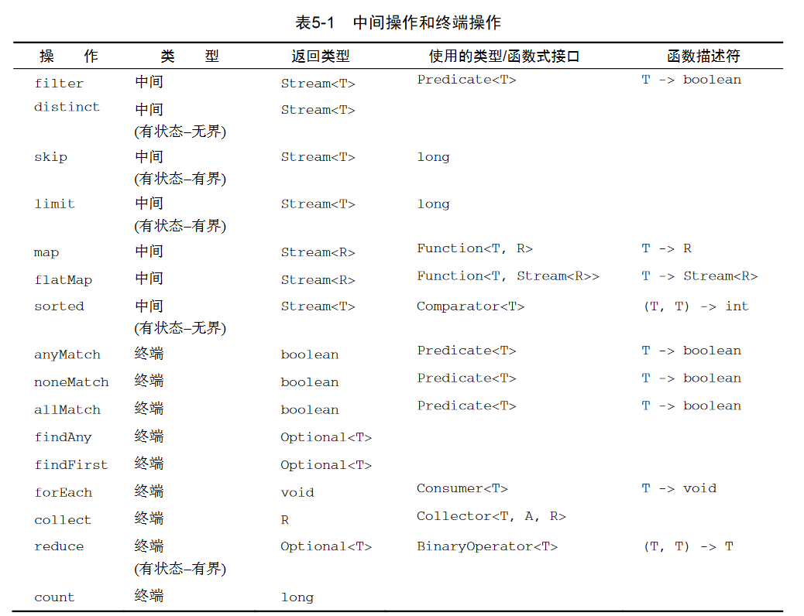

#### 5.数值流

**收集器使用groupingBy**：通过用户的用户名进行分组如下
```java
Map<String, List<YxUser>> collect = list.stream()
        .collect(groupingBy(YxUser::getUsername));
//多级分组
// 首先按照性别分组，然后按照id分组。
Map<Integer, Map<String, List<YxUser>>> collect = list.stream()
.collect(groupingBy(YxUser::getSex, // 一级分类函数
groupingBy(e -> { // 二级函数
    if (e.getId() > 5) return "hight";
    else if (e.getId() < 4) return "small";
    else return "midle";
})));
// 按照子组收集数据
Map<Integer, Long> collect = list.stream()
        .collect(groupingBy(YxUser::getSex, counting()));
/**
* counting 可以换成maxBy、minBy
*/
```

如果是自己写的话，会嵌套多层循环，多级分组那么将会更难维护。
Collectors.maxBy和Collectors.minBy在collect中使用，参数是自定义的Comparator

```java
Comparator<YxUser> comparator=Comparator.comparingInt(YxUser::getId);
Optional<YxUser> collect = list.stream()
        .collect(minBy(comparator));
// 使用reducing
Optional<YxUser> mostCalorieDish = list.stream().
collect(reducing( (d1, d2) -> d1.getId() < d2.getId() ? d1 : d2));
```

**summingInt**，在collect中计算总和。

```java
Integer collect = list.stream().collect(summingInt(YxUser::getId));
// 如果使用reducing
int totalCalories = list.stream().
collect(reducing( 0, //初始值
YxUser::getId,//转换函数
Integer::sum);//累积函数
//第一个参数是归约操作的起始值，也是流中没有元素时的返回值，所以很显然对于数值和而言0是一个合适的值。
//第二个参数就是你在6.2.2节中使用的函数，将菜肴转换成一个表示其所含热量的int。
//第三个参数是一个BinaryOperator，将两个项目累积成一个同类型的值。这里它就是对两个int求和
```

还有类似的函数：averagingInt计算平均值
> 但是还可以通过summarizingInt可以一次性得到：对应的最大值、最小值、平均值、和、数量等信息，可以通过getter获取
>
> 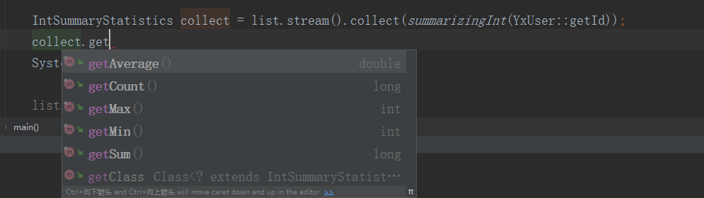

**joining连接字符串**：

​	joining实现字符串连接，是使用的StringBuilder，进行字符串拼接的

```java
String collect1 = list.stream().map(YxUser::getUsername).collect(joining());
System.out.println("collect1:" + collect1);
// 添加分割符
String collect2 = list.stream().map(YxUser::getUsername).collect(joining(", "));
System.out.println("collect2:" + collect2);
```

输出效果：

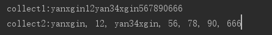

**求和的几种形式**：
```java
list.stream().mapToInt(YxUser::getId).sum();

list.stream().map(YxUser::getId).reduce(Integer::sum).get();

list.stream().collect(reducing(0, YxUser::getId, Integer::sum));

list.stream().collect(reducing(0, YxUser::getId, (x, y) -> x + y));
```

**字符串拼接的几种形式**

```
list.stream().map(YxUser::getUsername).collect(reducing((s1,s2)->s1+s2)).get();

list.stream().collect(reducing("",YxUser::getUsername,(s1,s2)->s1+s2));

String collect2 = list.stream().map(YxUser::getUsername)
.collect(joining(", "));
// 从性能上考虑，建议使用joining
```

**partitioningBy分区函数**：

返回的主键是 boolean类型，只有true和false两种情况。分区其实就是分组的一种特殊情况。

```java
Map<Boolean, List<YxUser>> collect = list.stream()
.collect(partitioningBy(YxUser::isX));
System.out.println("collect: " + collect);
```

**函数大全**

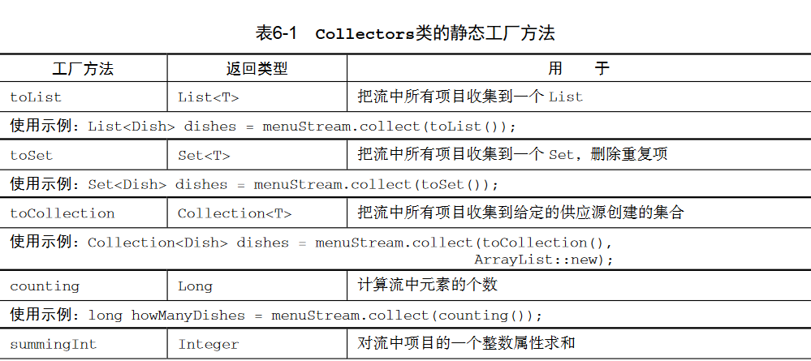

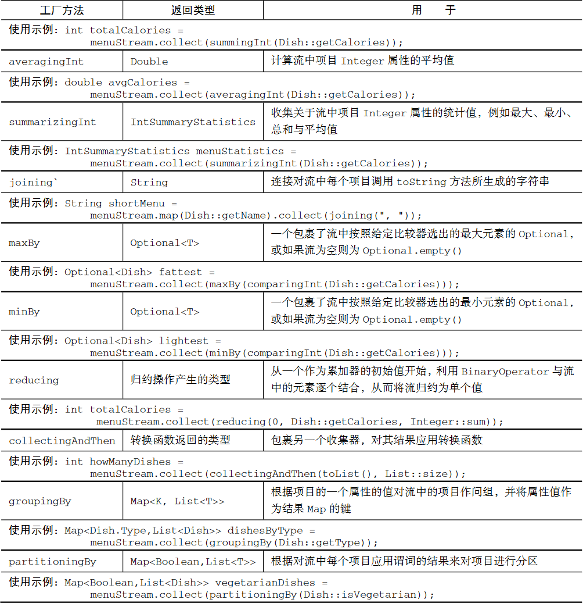


### 收集器Collector源码

​	 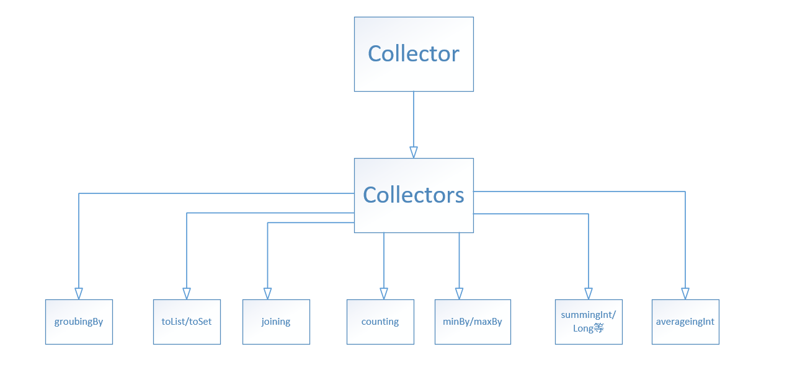

**Collector** 首先有5个主要的函数：supplier、accumulator、combiner、finisher、characteristics。

**supplier** ：调用这个函数的时候会创建一个空的累加器实例，供数据收集使用。

```java
/**  官方的解释
* A function that creates and returns a new mutable result container. 
* 
* @return a function which returns a new, mutable result container
*/
Supplier<A> supplier();
```

**accumulator** ： accumulator函数相当于是一个累加器，进行中间结果的处理。当遍历到流中第n个元素时，这个函数执行，时会有两个参数：保存归约结果的累加器（已收集了流中的前 n-1 个项目），还有第n个元素本身

```java
/** 官方的解释
* A function that folds a value into a mutable result container. 
* 
* @return a function which folds a value into a mutable result container 
*/
BiConsumer<A, T> accumulator();
```

**finisher** ： finisher函数主要是最后的工作，主要是将最后的结果进行转换。finisher方法必须返回在累积过程的最后要调用的一个函数，以便将累加器对象转换为整个集合操作的最终结果。

```java
/** 
* Perform the final transformation from the intermediate accumulation type 
* {@code A} to the final result type {@code R}. 
* 
* <p>If the characteristic {@code IDENTITY_TRANSFORM} is 
* set, this function may be presumed to be an identity transform with an 
* unchecked cast from {@code A} to {@code R}. 
* 
* @return a function which transforms the intermediate result to the final 
* result 
*/
Function<A, R> finisher();
```


> supplier、accumulator、finisher这三个函数就完全够流的顺序归约了
>
> 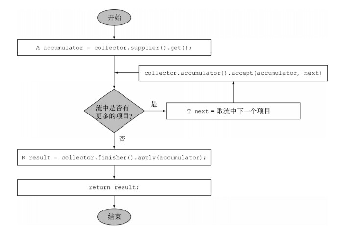

**combiner**：combiner方法会返回一个供归约操作使用的函数，它定义了对流的各个子部分进行并行处理时，各个子部分归约所得的累加器要如何合并。

```java
/** 
* A function that accepts two partial results and merges them.  The 
* combiner function may fold state from one argument into the other and 
* return that, or may return a new result container. 
* 
* @return a function which combines two partial results into a combined 
* result 
*/
BinaryOperator<A> combiner();
```

> supplier、accumulator、finisher这三个函数加上combiner这个函数，可以对流进行并行归约了，有点相当于并发环境的fork/join框架，他主要的步骤有一下几步：
>
> 第一步：将原始的流分成子流，知道条件不能分为止(分得太小也不好)
>
> 第二步：所有的子流并行运行。
>
> 第三步：使用收集器combiner方法返回的函数，将所有的部分合并。
>
> 这个流程和并发的fork/join差不多，可以参考我一篇博客：https://www.cnblogs.com/yangdagaoge/articles/10541460.html。

**characteristics** ：这个方法就是返回一个不可变的Characteristics，表示收集器的行为：

​	①：UNORDERED——归约结果不受流中项目的遍历和累积顺序的影响

​    ②：CONCURRENT——accumulator函数可以从多个线程同时调用，且该收集器可以并行归约流。

​	③：IDENTITY_FINISH——这表明完成器方法返回的函数是一个恒等函数，可以跳过。


但是点击Collector的实现类的时候发现他只有一个Collectors实现类并且在Collectors中定义了一个内部类CollectorImpl，其中的实现特别简单。如下：

```java
/**
     * Simple implementation class for {@code Collector}.
     *
     * @param <T> the type of elements to be collected
     * @param <R> the type of the result
     */
    static class CollectorImpl<T, A, R> implements Collector<T, A, R> {
        // 一系列的成员函数
        private final Supplier<A> supplier;
        private final BiConsumer<A, T> accumulator;
        private final BinaryOperator<A> combiner;
        private final Function<A, R> finisher;
        private final Set<Characteristics> characteristics;

        CollectorImpl(Supplier<A> supplier,
                      BiConsumer<A, T> accumulator,
                      BinaryOperator<A> combiner,
                      Function<A,R> finisher,
                      Set<Characteristics> characteristics) {
            this.supplier = supplier;
            this.accumulator = accumulator;
            this.combiner = combiner;
            this.finisher = finisher;
            this.characteristics = characteristics;
        }

        CollectorImpl(Supplier<A> supplier,
                      BiConsumer<A, T> accumulator,
                      BinaryOperator<A> combiner,
                      Set<Characteristics> characteristics) {
            this(supplier, accumulator, combiner, castingIdentity(), characteristics);
        }

        @Override
        public BiConsumer<A, T> accumulator() {
            return accumulator;
        }

        @Override
        public Supplier<A> supplier() {
            return supplier;
        }

        @Override
        public BinaryOperator<A> combiner() {
            return combiner;
        }

        @Override
        public Function<A, R> finisher() {
            return finisher;
        }

        @Override
        public Set<Characteristics> characteristics() {
            return characteristics;
        }
    }
```


#### 1.toList源码

```java
 /**
     * Returns a {@code Collector} that accumulates the input elements into a
     * new {@code List}. There are no guarantees on the type, mutability,
     * serializability, or thread-safety of the {@code List} returned; if more
     * control over the returned {@code List} is required, use {@link #toCollection(Supplier)}.
     *
     * @param <T> the type of the input elements
     * @return a {@code Collector} which collects all the input elements into a
     * {@code List}, in encounter order
     */
    public static <T>
    Collector<T, ?, List<T>> toList() {
        return new CollectorImpl<>((Supplier<List<T>>) ArrayList::new,
                        //创建一个ArrayList类型的Supplier收集器
        				List::add,// 使用list的add函数将流中的数据添加到空结果容器中
                        (left, right) -> { left.addAll(right); return left; },
                        // lambda 表达式，将右边的list添加到左边的list中，这就是相当于一个combiner函数
                        CH_ID);// 表示收集器的行为参数
    }
```

**使用toList**

```java
List<User> collect = list.stream().collect(Collectors.toList());
```

> toSet 的源码也是类型，不过吧Supplier 换成了 (Supplier<Set<T>>) HashSet::new
>
> ```java
> /**
>      * Returns a {@code Collector} that accumulates the input elements into a
>      * new {@code Set}. There are no guarantees on the type, mutability,
>      * serializability, or thread-safety of the {@code Set} returned; if more
>      * control over the returned {@code Set} is required, use
>      * {@link #toCollection(Supplier)}.
>      *
>      * <p>This is an {@link Collector.Characteristics#UNORDERED unordered}
>      * Collector.
>      *
>      * @param <T> the type of the input elements
>      * @return a {@code Collector} which collects all the input elements into a
>      * {@code Set}
>      */
>     public static <T>
>     Collector<T, ?, Set<T>> toSet() {
>         return new CollectorImpl<>((Supplier<Set<T>>) HashSet::new, Set::add,
>                                    (left, right) -> { left.addAll(right); return left; },
>                                    CH_UNORDERED_ID);
>     }
> ```


#### 2. 字符拼接joining源码

**①.无分隔符**

```java
 /**
     * Returns a {@code Collector} that concatenates the input elements into a
     * {@code String}, in encounter order.
     *
     * @return a {@code Collector} that concatenates the input elements into a
     * {@code String}, in encounter order
     *
     * CharSequence：这个是字符串序列接口
     * joining的源码可得，实现字符串拼接是使用 StringBuilder实现的，
     */
    public static Collector<CharSequence, ?, String> joining() {
        return new CollectorImpl<CharSequence, StringBuilder, String>(
                // 创建StringBuilder的结果容器
            	// StringBuilder::append：拼接函数(累加器部分)
                StringBuilder::new, StringBuilder::append,
            	// 联合成一个值，combiner部分
                (r1, r2) -> { r1.append(r2); return r1; },
            	// 最后结果的转换
                StringBuilder::toString, CH_NOID);
    }

```

>CharSequence 这是个字符串的序列接口，String、StringBuffer、StringBuilder也是实现这个接口。它和String的区别就是，String可读不可变，CharSequence是可读可变
>
>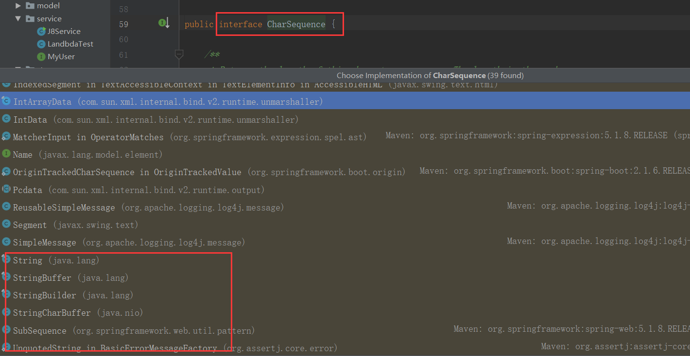

**使用字符串拼接**

```java
static List<User> list = Arrays.asList(
            new User("y杨鑫", 50, 5455552),
            new User("张三", 18, 66666), 
            new User("李四", 23, 77777),
            new User("王五", 30, 99999),
            new User("赵柳", 8, 11111),
            new User("王八蛋", 99, 23233)
    );

    public static void main(String[] args) {

        String collect = list.stream().map(User::getUsername)
                .collect(joining());
        System.out.println("collect: " + collect);
    }
////////////////////////////////////////输出/////////////////////////
collect: y杨鑫张三李四王五赵柳王八蛋
```


**②.带分割符的**

```java
/**
     * Returns a {@code Collector} that concatenates the input elements,
     * separated by the specified delimiter, in encounter order.
     * 返回一个带分割符的拼接串
     * @param delimiter the delimiter to be used between each element
     * @return A {@code Collector} which concatenates CharSequence elements,
     * separated by the specified delimiter, in encounter order
     * 将分割符传给了joining三参数的重载函数
     */
    public static Collector<CharSequence, ?, String> joining(CharSequence delimiter){
        return joining(delimiter, "", "");
    }

	/**
     * Returns a {@code Collector} that concatenates the input elements,
     * separated by the specified delimiter, with the specified prefix and
     * suffix, in encounter order.
     *
     * @param delimiter the delimiter to be used between each element
     * @param  prefix the sequence of characters to be used at the beginning
     *                of the joined result
     * @param  suffix the sequence of characters to be used at the end
     *                of the joined result
     * @return A {@code Collector} which concatenates CharSequence elements,
     * separated by the specified delimiter, in encounter order
     *
     *  在这个函数中，使用了一个叫StringJoiner的类，这个是java8的封装类，主要的功能是
     *  按照 分割符delimiter，字符串开始 prefix，字符串结尾suffix，进行字符串的拼接
     */
    public static Collector<CharSequence, ?, String> joining(CharSequence delimiter,
                                                             CharSequence prefix,
                                                             CharSequence suffix) {
        return new CollectorImpl<>(
            	// 创建一个Supplier结果容器
                () -> new StringJoiner(delimiter, prefix, suffix),
            	// 字符串的添加相当于 accumulator累加器部分；merge是联合将两个数值整合成一个，相当于combiner部分
                StringJoiner::add, StringJoiner::merge,
            	// toString做最后的结果转换
                StringJoiner::toString, CH_NOID);
    }
```

**运行样例**

```java
        String collect = list.stream().map(User::getUsername)
                .collect(joining());
        System.out.println("collect: " + collect);
        
        String collect1 = list.stream().map(User::getUsername)
                .collect(joining(","));
        System.out.println("collect1: " + collect1);
        
        String collect2 = list.stream().map(User::getUsername)
                .collect(joining(",","[","]"));
        System.out.println("collect2: " + collect2);
///////////////////////输出//////////////////////////////
collect: y杨鑫张三李四王五赵柳王八蛋
collect1: y杨鑫,张三,李四,王五,赵柳,王八蛋
collect2: [y杨鑫,张三,李四,王五,赵柳,王八蛋]

```


